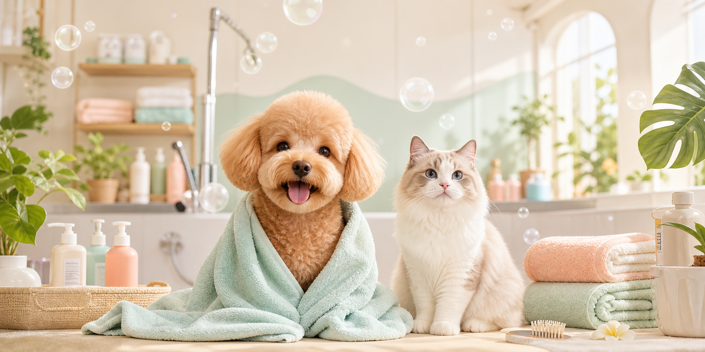

# 泡泡爪宠物洗护店




这是一间给猫猫狗狗准备的线上洗护门店。

它不是一张冷冰冰的价格表，而是一块会发光的门店招牌：主人可以先感受到门店的干净、温柔和可靠，再浏览洗护套餐、了解到店流程、查看空间环境，最后提交预约信息。

在这个项目里，洗澡不是简单的“冲一冲”。它被设计成一次完整的护理体验：先了解宠物状态，再评估毛发和皮肤，然后安排分区洗护、吹干、修剪和离店反馈。页面想传达的感觉很简单：把宠物交给这里，主人可以放心一点。

## 项目亮点

| 模块 | 它在页面里做什么 |
| --- | --- |
| 品牌首页 | 用一屏主视觉建立“干净、温柔、预约制”的门店印象 |
| 洗护套餐 | 展示基础洗护、全身精修、皮毛舒缓护理等服务 |
| 到店流程 | 让用户知道从健康询问到交接反馈，每一步都不是随便来 |
| 门店环境 | 展示接待区、洗护区、修剪区，让空间感更真实 |
| 预约表单 | 收集称呼、电话、宠物类型、服务项目和备注 |

## 页面气质

这个网站的关键词是：

```text
柔和、明亮、可信赖、有服务感、适合宠物门店展示
```

它适合用作宠物洗护店、宠物美容工作室、社区宠物护理门店的官网雏形。视觉上偏干净明亮，内容上强调透明流程和预约服务，避免让用户觉得这只是一个“堆套餐”的页面。

## 技术栈

| 技术 | 用途 |
| --- | --- |
| Next.js | 页面框架与应用结构 |
| React | 组件化 UI |
| CSS | 页面布局、响应式和视觉样式 |

## 本地运行

```bash
npm install
npm run dev
```

浏览器打开：

```text
http://localhost:3000
```

## 项目结构

```text
app/
  globals.css      页面样式
  layout.jsx       页面基础布局
  page.jsx         首页内容

components/
  BookingForm.jsx  预约表单组件

public/assets/
  readme-hero.png                 README AI 封面图
  store-grooming-outline.png      修剪区图片
  store-reception-outline.png     接待区图片
  store-wash-spa-outline.png      洗护区图片
```

## 可以继续长出来的功能

- 接入真实预约接口，把表单数据保存到后台
- 增加管理员预约列表，方便门店查看客户信息
- 加入服务价格后台配置，让套餐内容可以动态维护
- 接入地图和营业时间，让线下到店路径更清晰
- 修复当前源码里的中文编码显示问题，让页面文案恢复为正常中文

## AI 生成资源

README 顶部封面图由 AI 生成，并已保存到：

```text
public/assets/readme-hero.png
```

生成方向：明亮的宠物洗护工作室、刚洗护完成的小狗和猫、柔和泡泡、干净可信赖的门店氛围。

